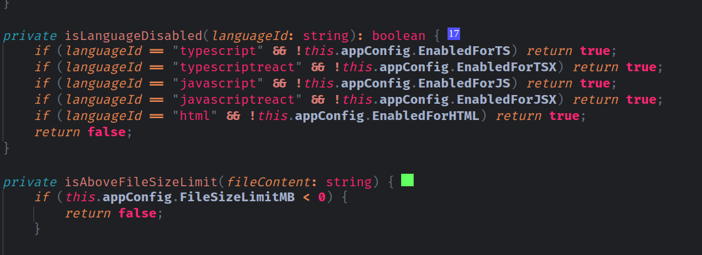

# Code Complexity - Fork of Code Metrics

Fork of https://github.com/kisstkondoros/codecomplexity

Differences:

- no change of decorations on unsaved changes; only on save event.
- hide decorations when file is dirty, i.e. changed but not yet saved. This helps with hanging decorations(decorations on wrong lines), but also to optimize performance.
- using latest dependencies - main reason for the fork was to be able to update dependencies
- show complexity number inside the decoration; no need to hover to see the number
- different color sets depending if current theme is dark or light
- no lua/vue/html support
- no second decoration, `CodeLensEnabled` is not used

## Features

### Code Complexity

Instead of showing only 4 colors, it shows 25 colors. 

The color of the decoration is based on the complexity of the function.

Complexity value is shown inside decoration square.

Complexity between `0` and `12` is shown in green.

Complexity between `12` and `22` is shown in blue. 

Complexity between `22` and `32` is shown in red. 

Complexity above `32` is shown in purple.
